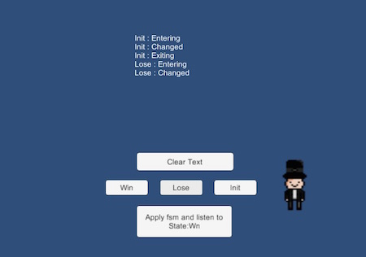
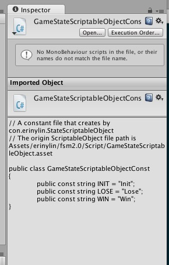

# Unity Utilities : erinylin.lazylib
主要都是研究 Unity 功能順便時實作的組件，基本都是秉持懶人精神，朝使用便捷的方向製作。每個專案都會附上範例場景。

## erinylin_fsm.unitypackage
A finite-state machine (FSM), easy to use also can be set by Inspector window.

有限狀態機

## erinylin_sceneloader.unitypackage
Camera-specific component for Scene transition that handle to load the next scene and crossfading between scenes. 

轉場用組件，Camera 專用，處理下個場景載入，順便以交互淡出轉場。只針對掛載的 Camera 畫面作截圖。Canvas 畫面如果需要被印製，需要修改 Rander Mode。
	
	//Add SceneLoader Component in Main Camera.
	using erinylin.lazylib;

	SceneLoader loader = FindObjectOfType<SceneLoader>();
	loader.ToScene = "The Next Scene Name";
	loader.Play();

## erinylin_fsm2.0.unitypackage

A finite-state machine (FSM) v2.0, use ScriptObject to preset states.
有限狀態機更新版。本人有強迫症，喜歡將工具儘量寫到懶人極致。本版本主要是學習到 ScriptableObject and EditorGUI 時改寫的。

#### Feature:

* Change the State class to ScriptableObject. And rewrite FSMSystem class. 將 State class 改成 ScriptableObject, 並修正了 FSMSystem class 的一些函式。
* Export the State of Constant class by one click. 重點來了，建立好的 StateScriptableObject 可以直接點選 Export 按鈕建立其常數類別檔！

State ScriptableObject can create by `Assets / Create / Lazylib / StateScriptableObject`

懶人守則: 能自動化的就不用手打
Exports the State of Constant class file by one click.
