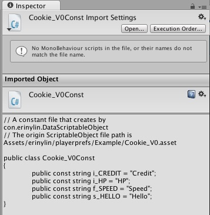

# Unity Utilities : erinylin.lazylib

[ <- Back ](README.md)

## erinylin_cookie.unitypackage

A wrapper tool for PreviewLabs.PlayerPrefs provides data editing with debugs window output. Also contains version control ability.

##### *** Remember to modify encryption key first befor you start to run a scene.
Open `Assets/erinylin/playerprefs/External/PlayerPrefs.cs`, then find the script below:

	//For modify the iw3q part to an arbitrary string of length 4 for your project
	private static byte[] bytes = ASCIIEncoding.ASCII.GetBytes ("iw3q" + SystemInfo.deviceUniqueIdentifier.Substring (0, 4));

* NOTE: If you <b>change encryption key</b> after running the scene once, you will need to delete AdvancedPlayerPrefs.txt file, otherwise it will get errors.

		OSX or Windows:
			//print out the path and then delete it...=P
			print( Application.persistentDataPath + "/AdvancedPlayerPrefs.txt" ); 

		iOS & Android: 
			Just removes the App and install it again.

* NOTE: if something went wrong, just click the `Reset PlayPrefs` button.

#### Feature:

1. Cookie Manager
 

2. DataObject mix type editing.
DataScriptableObject can create by `Assets / Create / Lazylib / DataScriptableObject`
  
	
3. Runtime debugs window, only in Unity Editor Mode.
 

4. Exports the DataObject of Constant class file by one click.
 

5. Version control
The higher Version Code of DataScriptableObject's data will rewrite the same name priperties of lower's.

##### External library:

* [PreviewLabs.PlayerPrefs](http://previewlabs.com/writing-playerprefs-fast/)
