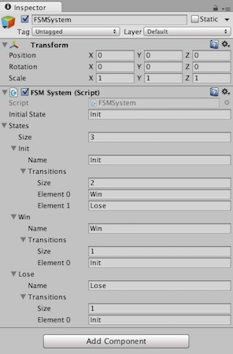
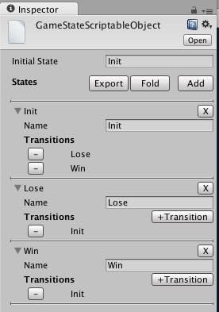
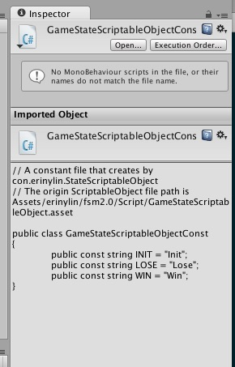

# Unity Utilities : erinylin.lazylib

[ <- Back ](README.md)

## erinylin_fsm.unitypackage
A finite-state machine (FSM), easy to use also can be set by Inspector window.

有限狀態機

## erinylin_fsm2.0.unitypackage

A finite-state machine (FSM) v2.0, use ScriptObject to preset states.
有限狀態機更新版。本人有強迫症，喜歡將工具儘量寫到懶人極致。本版本主要是學習到 ScriptableObject and EditorGUI 時改寫的。

#### Feature:

* Change the State class to ScriptableObject. And rewrite FSMSystem class. 將 State class 改成 ScriptableObject, 並修正了 FSMSystem class 的一些函式。
* Export the State of Constant class by one click. 重點來了，建立好的 StateScriptableObject 可以直接點選 Export 按鈕建立其常數類別檔！

State ScriptableObject can create by `Assets / Create / Lazylib / StateScriptableObject`

懶人守則: 能自動化的就不用手打
Exports the State of Constant class file by one click.
