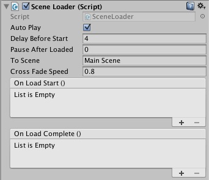

# Unity Utilities : erinylin.lazylib

[ <- Back ](README.md)

## erinylin_sceneloader.unitypackage
Camera-specific component for Scene transition that handle to load the next scene and crossfading between scenes. 

轉場用組件，Camera 專用，處理下個場景載入，順便以交互淡出轉場。只針對掛載的 Camera 畫面作截圖。Canvas 畫面如果需要被印製，需要修改 Rander Mode。
	
	//Add SceneLoader Component in Main Camera.
	using erinylin.lazylib;

	SceneLoader loader = FindObjectOfType<SceneLoader>();
	loader.ToScene = "The Next Scene Name";
	loader.Play();

